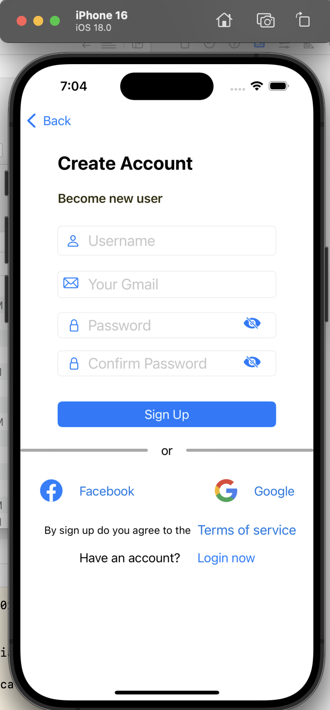

# Facebook Login Page App

This project is a **Facebook Login Page clone** created as part of an iOS training exercise. The app features a login and sign-up interface styled similarly to Facebook's UI, providing a streamlined user experience for authentication.

## Features

- **Login Screen**: Allows users to enter their username and password with the option to navigate to the sign-up screen.
- **Sign-Up Screen**: Enables new users to register with fields for username, email, password, and password confirmation.
- **Navigation**: Users can navigate between the login and sign-up screens easily with a "Sign Up" link and "Login now" option.

## Screenshots

### 1. Login Screen


### 2. Sign-Up Screen



## How to Use

1. **Clone the repository**:
   ```bash
   git clone https://github.com/your-username/facebook-login-page-app.git
